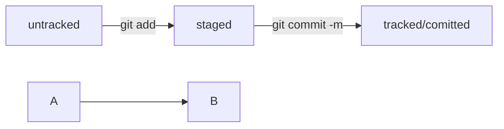

# GIT
---
*Git* — это система контроля версий, которая помогает отслеживать изменения в проекте. Этот инструмент можно использовать как для индивидуальной, так и для командной работы.

## Начало работы

### Инициализируем репозиторий

В корневой папке нашего проекта выполняем команду:

```bash
git init
```


Перед началом нужно создать SSH-ключ в домашнем каталоге и вывести на экран для копированияй:

```bash
ssh-keygen
cat ./.ssh/id_rsa.pub
```
  
В настройках аккаунта GitHub вставляем показанный ключ и сохраняем, теперь мы можем подключаться к удалённому репозиторию по SSH.


  
Если ошиблись папкой или по какой-то причине нужно отключить/удалить контроль версий, поможет команд, она полностью удалит папку git из ропозитория:
```bash
rm -rf .git
```

## Загружаем репозиторий
На GitHub создаём пустой репозиторий, копируем url SSH и привязываем к локальному:
```bash
git remote add <url>
```


На другом компьютере можно скачать этот репозиторий и продолжить работу.
``` bash
git clone <url>
```

## Запомни
** В случае пожара**
1. git add --all
2. git commit -m'<messange>
3. git push
PROFIT!!!

## Навигация и статусы


