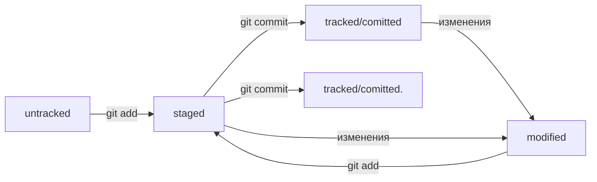

# GIT

*Git* — это система контроля версий, которая помогает отслеживать изменения в проекте. Этот инструмент можно использовать как для индивидуальной, так и для командной работы.

## Начало работы

### Инициализируем репозиторий

В корневой папке нашего проекта выполняем команду:
```bash
git init
```

В подпапке .git Git будет хранить всю служебную информацию.

Если ошиблись папкой или по какой-то причине нужно отключить/удалить контроль версий, поможет следующая команда, она полностью удалит папку git из репозитория:
```bash
rm -rf .git
```

Проверить состояние репозитория:
```bash
git status
```


### Добавляем файлы в репозиторий

Подготовить файлы к сохранению, указывается конкретный файл (filename), или вся папка (.), или весь репозиторий (--all):
```bash
git add
```

 Команда git add не сохраняет содержимое файлов в репозитории. Само сохранение, или фиксацию состояния файлов, называют коммитом (от англ. commit — «совершать», «фиксировать»). «Сделать коммит» значит сохранить текущую версию файла. 


### Делаем коммит

Коммит — это одна из основных сущностей в Git (и в других системах контроля версий). Коммит гарантирует, что изменения будут сохранены в истории и при необходимости к ним можно будет «откатиться». 

Выполнить коммит:
```bash
git commit -m'message'
```

Коммит нужно описывать так, чтобы было понятно, какие именно изменения были сделаны!


### История коммитов

Посмотреть история коммитов, последние коммиты показываются первыми сверху:
```bash
git log
```


## Синхронизация

### SSH

Когда компьютеры обмениваются данными в сети, они следуют сетевым протоколам (англ. network protocols) — правилам обмена данными между компьютерами.
Один из наиболее распространённых сетевых протоколов — SSH (от англ. Secure Shell Protocol). Он обеспечивает безопасный обмен данными в сети. С помощью этого протокола можно получать данные с удалённого компьютера или отправлять их на него. Трафик шифруется, поэтому протокол безопасен.
SSH использует пару ключей для обеспечения безопасности — публичный и приватный:

* Приватный ключ (англ. private key) хранится только на вашем компьютере и не должен передаваться кому-либо ещё. Он используется для расшифровки данных.
* Публичный ключ (англ. public key) доступен всем и используется для шифрования данных. Они могут быть расшифрованы парным приватным ключом.

Только вы можете расшифровать данные с помощью приватного ключа, но любой владелец публичного ключа может их для вас зашифровать. Эти два ключа связаны и образуют SSH-пару. В будущем вы наверняка будете использовать их для взаимодействия с GitHub и другими удалёнными серверами.

Cоздаём SSH-ключ в домашнем каталоге, проверяем его наличие в папке и выводим на экран для копирования:
```bash
cd ~
ssh-keygen
ls -a ~/.ssh 
cat ~/.ssh/id_rsa.pub
```

Файл с расширением .pub — публичный, им можно делиться с веб-сайтами или коллегами. Файл без расширения .pub — приватный. Ни в коем случае не передавайте его никому!

В настройках аккаунта GitHub вставляем показанный ключ и сохраняем, теперь мы можем подключаться к удалённому репозиторию по SSH.

Затем проверим ключ, подключившись к серверу GitHub командой:
```bash
ssh -T git@github.com
```


### Связываем локальный и удалённый репозитории

На GitHub создаём пустой репозиторий, копируем url SSH и привязываем к локальному из папки репозитория:
```bash
git remote add origin <url>
```


*origin* (англ. «источник») — стандартный псевдоним, с помощью которого можно обращаться к главному удалённому репозиторию (обычно такой репозиторий один). Это значительно упрощает работу.

Убедимся, что репозитории связаны:
```bash
git remote -v
```

### Синхронизируем локальный и удалённый репозитории

В репозитории может существовать сразу несколько веток — параллельных историй изменений. Также они могут соединяться друг с другом.

Отправить изменения на удалённый репозиторий:
```bash
git push
```

В первый раз эту команду нужно вызвать с флагом -u и параметрами origin (имя удалённого репозитория) и main или master (название текущей ветки). Флаг -u свяжет локальную ветку с одноимённой удалённой.

На другом компьютере можно скачать этот репозиторий и продолжить работу.
```bash
git clone <url>
```


### README

Чтобы другие пользователи, а также потенциальные клиенты или работодатели могли понять, что представляет собой проект, его нужно описать. Такое описание принято указывать в файле README.md.

Преимущество README.md в том, что средства командной работы (такие, как GitHub) могут отображать его содержимое в браузере в виде удобной разметки. Для этого нужно не просто залить текст, но и настроить шрифт, заголовки и отступы с помощью *markdown*.

[Шпаргалка по Markdown 1](https://gist.github.com/fomvasss/8dd8cd7f88c67a4e3727f9d39224a84c "Шпаргалка по Markdown 1")

[Шпаргалка по Markdown 2](https://www.markdownguide.org/cheat-sheet/ "Шпаргалка по Markdown 2")


## Навигация и статусы

### Хэш

Хеширование (от англ. hash, «рубить», «крошить», «мешанина») — это способ преобразовать набор данных и получить их «отпечаток» (англ. fingerprint).

Информация о коммите — это набор данных: когда был сделан коммит, содержимое файлов в репозитории на момент коммита и ссылка на предыдущий, или родительский (англ. parent), коммит.

Git хеширует (преобразует) информацию о коммите с помощью алгоритма SHA-1 (от англ. Secure Hash Algorithm — «безопасный алгоритм хеширования») и получает для каждого коммита свой уникальный хеш — результат хеширования.

Обычно хеш — это короткая (40 символов в случае SHA-1) строка, которая состоит из цифр 0—9 и латинских букв A—F (неважно, заглавных или строчных). Она обладает следующими важными свойствами:

* если хеш получить дважды для одного и того же набора входных данных, то результат будет гарантированно одинаковый;
* если хоть что-то в исходных данных поменяется (хотя бы один символ), то хеш тоже изменится (причём сильно).

### Лог

После вызова *git log* появляется список коммитов.

Разберём элементы, из которых состоит описание:

* строка из цифр и латинских букв после слова commit — это хеш коммита;
* Author — имя автора и его электронная почта;
* Date — дата и время создания коммита;
* в конце находится сообщение коммита.

Получить сокращённый лог:
```bash
git log --oneline
```

Сокращённый хеш (то есть первые несколько символов полного) можно использовать точно так же, как и полный. Для этого команда *git log --oneline* автоматически подбирает такую длину сокращённых хешей, чтобы они были уникальными в пределах репозитория и Git всегда мог понять, о каком коммите идёт речь.

### HEAD

Файл HEAD (англ. «голова», «головной») — один из служебных файлов папки .git. Он указывает на коммит, который сделан последним (то есть на самый новый).

Внутри HEAD — ссылка на служебный файл: refs/heads/master (или refs/heads/main в зависимости от названия ветки). Если заглянуть в этот файл, можно увидеть хеш последнего коммита.

Если нужно передать последний коммит, то вместо его хеша можно просто написать слово HEAD — Git поймёт, что вы имели в виду последний коммит.

### Статусы

Одна из ключевых задач Git — отслеживать изменения файлов в репозитории. Для этого каждый файл помечается каким-либо статусом. Рассмотрим основные.

* untracked (англ. «неотслеживаемый») - Git «видит», что такой файл существует, но не следит за изменениями в нём.
* staged (англ. «подготовленный») - после выполнения команды git add файл попадает в staging area (от англ. stage — «сцена», «этап [процесса]» и area — «область»), то есть в список файлов, которые войдут в коммит.
* tracked (англ. «отслеживаемый») - в него попадают файлы, которые уже были зафиксированы с помощью git commit, а также файлы, которые были добавлены в staging area командой git add. То есть все файлы, в которых Git так или иначе отслеживает изменения.
* modified (англ. «изменённый») - означает, что Git сравнил содержимое файла с последней сохранённой версией и нашёл отличия.




## Работа над ошибками

### Сообщения к коммитам

В разных командах есть свои правила сообщений коммитов, но есть общие принципы описания.

Например, в выводе команды *git log --oneline* умещается максимум 72 первых символа сообщения, поэтому многие правила включают пункт: «Сообщение не должно быть длиннее 72 символов».

Есть общие рекомендации по тому, как правильно составить сообщение. Оно должно быть:

* относительно коротким, чтобы его было легко прочитать;
* информативным.

Чтобы упростить работу, команды или даже целые компании часто договариваются об определённом стиле (то есть о правилах) оформления сообщений коммитов.

Во многих компаниях применяется Jira — система для организации проектов и задач. У каждой задачи в Jira есть идентификатор из нескольких заглавных латинских букв и номера. Например, LGS-239 значит, что это 239-я задача в проекте LGS (сокращение от англ. logistics — «логистика»).  
В корпоративном стиле в начале сообщения обычно указывают Jira-ID, а после — текст сообщения.

Стандарт **Conventional Commits** (англ. «соглашение о коммитах») отличается качественной документацией и подробной проработкой. Он подходит для репозиториев с исходным кодом программ. Использовать его для других типов проектов (например, для перевода книги) было бы неудобно.

Conventional Commits предлагает такой формат коммита: <type>: <сообщение>.  
Первая часть type — это тип изменений. Таких типов достаточно много. Вот два примера:
* feat (сокращение от англ. feature) — для новой функциональности;
* fix (от англ. «исправить», «устранить») — для исправленных ошибок.

**GitHub** можно использовать не только для хранения файлов проекта, но и для ведения списка задач (англ. issue) этого проекта. Если коммит «закрывает» или «решает» какую-то задачу, то в его сообщении удобно указывать ссылку на неё. Для этого в любом месте сообщения нужно указать #<номер задачи>. В таком случае GitHub свяжет коммит и задачу.

Для сообщений на русском языке часто рекомендуют использовать инфинитивы. Например: Исправить ошибку #123.  
Для сообщений на английском рекомендуется использовать повелительное наклонение (англ. imperative). Например: Use library mega_lib_300, Fix exit button.  
Эти рекомендации сложились исторически, и им следуют многие проекты.


## **В случае пожара** :fire::fire::fire:

1. git add --all
2. git commit -m'message'
3. git push

PROFIT!!!